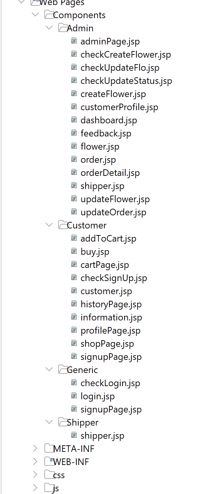

# Report Assignment
### FALL 2023 - Block 3 weeks 
### Detailed Specification

## **Project Synopsis:**
- **Class:** PRJ301_BL3W_03
- **Project Supervisor:** Huynh Ngoc Dung - DungHN14
- **Group:** 08 (PRO_blem)
- **Authors:**
  - Nguyễn Dương Gia Bảo - SE171697 - Rous1141 - FE
  - Huỳnh Thiện Nhân - SE171117 - Dacoband - FE
  - Đỗ Trọng Phú - SE173422 - dotrong-code - BE
  - Phạm Nhật Duy - SE173520 - nhatduy111003 - BE
- **Project:** Store Management - E-commerce - Business to Consumer
- **Techs:** SQL Server - Java - MaterializeCSS - Bootstrap - JavaScript - Recapchant 
- **Structure:** Using MVC2 Design Pattern 

## **Requirements:**
- **Name of My System:** Flowers Store
- **Purpose of the System:**
  - Provide High-Quality Products: The primary purpose is to offer high-quality, fresh, and visually appealing flower products to meet customer needs.
  - Create a Positive Shopping Experience: The shop may focus on creating a positive shopping experience with a user-friendly interface and excellent customer service.
  - Efficient Delivery Service: If the shop provides delivery services, the purpose may be to offer fast, safe, and punctual deliveries to enhance customer satisfaction.
  - Build a Unique Brand: The goal may be to build a distinctive brand with unique products and services.

## **System Features & User Roles:**
- *Note: You must log in to enter the website.*

  **Customers:**
  You can sign up if you don’t have an account.
  - After logging in, customers can buy flowers.
  - Page to display all flowers.
  - Search flowers by name.
  - View order history.
  - View & update the profile.
  - View the cart page before buying. Can cancel the order before admin confirms the order.
  - Feedback on orders.
  
  **Admin:**
  - After logging in, the admin has a dashboard to perform some functions.
  - Manage customers: View, update, block/unblock customers, and search customers by email or name.
  - Manage flowers: Create, update, disable, and search by name.
  - Manage orders: View orders, search orders, and change the status of orders.
  - Assign orders to a shipper.
  - View feedback from customers.
  
  **Shipper:**
  - See delivery orders assigned by admin.
  - Confirm or cancel orders when reaching the customer. If canceled, comment on the reason for cancellation.

## **Design Figma - Draw GUIs:**

### **Login & Sign Up:**
  - Login Page:
    
  - Sign Up Page:
    

 ### **Admin Page:**
   - User's information:
       
  - Shipper & Order:
    
  - Feedbacks:
    

### **Customer Page:**
  - Customer Page: 
  
  - Customer Profile:
  
  - Cart Page' Customer: 
  
  - Order History Page:
  
  - FeedBack's Customer:
  

### **Shipper:**
  - Shipper Page: 
  
  - Shipper Order Cancellation:
  
  - Shipper Profile:
  
  - Edit Profile:
  

## **Database Design:**

## **System Design**

  - ### MainController: 
  
    
    - MainController will be booted when the website is accessed by users. From there, MainController will route users to other smaller controllers(Login, Admin, Shipper, Customer) for each specific process. Notice: All Controller (beside Main) will have a session checking for security purpose.

  - ### LoginController: 
    
    - At first, LoginController routes you to login.jsp(Login Page). User will input their account information and click submit. Afterward, a check login page will check your credentials with the data in DB. If your info is correct, a new session will be created and a "role" is sent back to LoginController through an attribute. LoginController will then store the user data in session and send some information (user role) back to MainController. MainController will then direct you to other Controllers(Admin, Shipper, Customer) based on your role.
    - LoginController will also be invoked when user log out to delete (invalidate) their session.

  - ### CustomerController:
    
    - CustomerController handle the shop pages, customer profile, shopping cart, order creation, order history. Customer can only access all the pages in the Customer Components.

  - ### AdminsController:
    
    - AdminController handle the admin process with managing anything related in the shop. AdminController will dispatch your request to appropriate    file.jsp to perform and handle your request and send you back to the main admin page.

  - ### ShipperController:
    
    - ShipperController handle the shipper profile, and handle the button to confirm order delivery. Customer can only access all the pages in the Shipper Components. 

  - ### Components :
    - The backend structure of the system. Using MVC2 model. With the DAO package to store query function to access and extract DB data(CRUD). DTO is the OOP method of Java, every table in the database is an "object" in the java code.

    
      
    - Frontend of the web. Mainly using **.jsp** file to intergrate Java code with Html language. We use JSP files to perform some functions (CRUD, Check Login,...).
    
    
    
    

  - ### Structure Desginations:

    - DataFlow: This is a model of how the project works through the MVC2 model, implemented through Controller pages.
    
    

## **Conclusion and Discussion**
  - ### *The pros and cons of your application.*
  
      ## Pros :
      1. _Convenient Shopping Experience:_ Customers can conveniently browse and purchase flowers from the comfort of their homes, promoting a positive user experience.
       2. _Efficient Order Management:_ The system can streamline order processing, reducing manual errors and improving overall efficiency for administrators.
       3. _Scalability:_ The system can be designed to handle an increasing number of products, customers, and orders as the business grows.
       4. _Minimal Design:_ The simple design makes it easy for users and store managers to use and manage their orders or quantities of products.
     
     ## Cons :
       1. _Technical Challenges:_ Issues such as system glitches, downtimes, or technical difficulties could impact the user experience and require prompt resolution.
       2. _Project Scale:_ The project is still in a state of incomplete development and has not yet had a large scale for investment.
       3. _Competition and Marketing:_ In a competitive market, attracting and retaining customers may require additional efforts in marketing and differentiation.
       4. _The drawback_ is that there are still many forms of payment such as paying by international credit card.
  
   

  - ### *What you've learned during developing of your application?*
     1. Learn how to develope a full-scale web project reflect accurately of current market trends.
     2. Learn how to implimement the MVC2 structure into production.
     3. Writing documentation for software developement and requirements
     4. Learning practical experiences for making a system for the next capstone projects (SWP391).
     5. Learning the importanceness of roles:
        - Backend
        - Frontend
        - Testers
     6. Experiences in how to use advance technology to improve the project 

   

   - ### *What would you improve your application in the future ?*
     1. Enhanced Personalization: Implement personalized recommendations based on customer preferences and purchase history. Use machine learning algorithms to suggest flowers or arrangements tailored to individual tastes.
    
    
     2. Subscription Services: Introduce subscription services for regular flower deliveries. Customers can set up recurring orders for special occasions or regular floral arrangements, fostering customer loyalty.
    
    
     3. Social Media Integration: Enhance social media integration to allow customers to share their purchases directly from the application. This can serve as user-generated content and promote the flower shop through social networks.
    
    
     4. Multi-Language Support: Expand the application's reach by adding support for multiple languages. This can attract a more diverse customer base and make the platform accessible to users globally.
    
    
     5. Expanded Product Information: Provide more detailed information about each flower type, including care instructions and origin. This can educate customers and enhance their overall experience.

  

